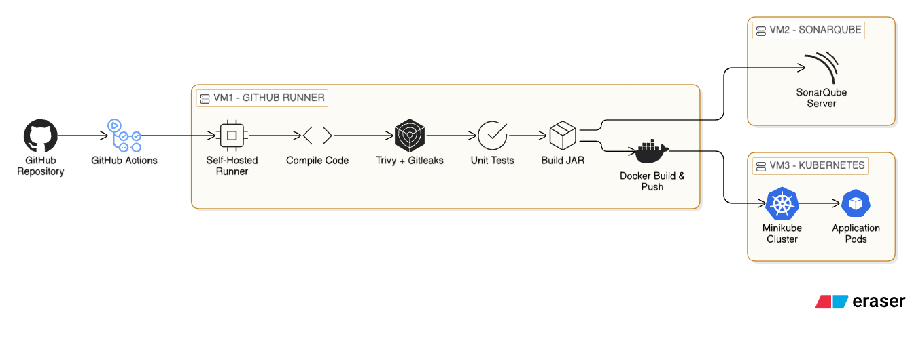

# Bank Project - Cloud Infrastructure & DevSecOps Pipeline

A professional, cloud-native Spring Boot banking service built to support core account operations (Deposit, Withdraw, and Print Account Statement).

What sets this project apart is its robust **DevSecOps** pipeline and infrastructure. It demonstrates a complete "Startup to Scale" lifecycle—from source code in GitHub to an automated CI/CD pipeline featuring security scanning, static code analysis, Docker image building, and eventually deploying to a locally managed Kubernetes cluster equipped with Prometheus and Grafana for comprehensive observability.

---

## 🏛️ Project Architecture

Our multi-environment infrastructure is managed locally using **Vagrant** to recreate a production-grade enterprise deployment cycle.



### The Infrastructure Environments

Our environments are isolated via Vagrant VMs, provisioned through Ansible and Shell Scripts:

1. **VM1 (GitHub Runner):** Hosts the Self-Hosted GitHub Actions runner executing all pipeline steps.
2. **VM2 (Static Analysis):** Hosts the SonarQube Server validating code syntax, coverage, and vulnerabilities.
3. **VM3 (Kubernetes Cluster):** A Minikube environment handling the application pod orchestration, load balancing, and the `kube-prometheus-stack` (Prometheus & Grafana) monitoring stack.

---

## 🚀 Tech Stack

- **Application Language:** Java 21 + Spring Boot 3.5.3
- **Build Tool:** Maven
- **Infrastructure:** Vagrant, VirtualBox
- **Configuration Management:** Ansible
- **CI/CD Orchestration:** GitHub Actions
- **Security & Quality:** Trivy, Gitleaks, SonarQube
- **Containerization:** Docker
- **Orchestration & Deployments:** Kubernetes (Minikube), Helm
- **Monitoring:** Prometheus & Grafana

---

## 🛠️ Project Structure

```text
.
|-- src/                      # Java Application Source Code
|-- k8s/                      # Kubernetes Manifests (Deployment & Service)
|-- ansible/                  # Ansible playbooks (VM1 & VM2 Setup)
|-- VM1-Runner/               # Vagrantfile for self-hosted Runner
|-- VM2-SonarQube/            # Vagrantfile for SonarQube Server
|-- VM3-k8s-server/           # Vagrantfile for Minikube, Docker, and Monitoring
|-- Dockerfile                # Multi-stage Docker build config
|-- pom.xml                   # Maven dependencies and build parameters
`-- .github/workflows/        # CI/CD Pipeline Definitions
```

---

## 🔄 CI/CD Pipeline (`cicd.yml`)


The workflow operates autonomously on every push to the `main` branch:

1. **Build & Test:** Checks out the code, verifies dependencies, runs unit tests, and packages the artifacts via `mvn clean package`.
2. **Code Analysis:** Connects to `VM2`, sending project telemetry and generating analytical reports inside SonarQube.
3. **Docker Build & Push:** Packages the generated `.jar` into an image using our `Dockerfile`. Deploys directly to Docker Hub using secure tokens.
4. **Scan Image:** Scans the exact, newly generated Docker container for vulnerabilities using **Trivy**.
5. **Deploy to K8s:** Automatically pushes the new Docker Hub image down to the Kubernetes cluster hosted in `VM3` via `kubectl apply`.

_Note: You must setup your repository secrets (`DOCKER_USERNAME`, `DOCKER_PASSWORD`, `SONAR_HOST_URL`, `SONAR_TOKEN`) for this pipeline to succeed._

---

## ⚙️ Getting Started locally

### Prerequisites

- Java 21
- Maven 3.9+
- Docker (for container execution)
- Vagrant & VirtualBox (for running the full DevOps topology)

### 1. Compile & Test Locally

```bash
mvn clean spring-boot:run
mvn test
```

### 2. Stand Up the Infrastructure

Start up the targeted VMs if you want to deploy the code, or configure the self-hosted runners.

```bash
cd VM3-k8s-server/
vagrant up
```

_VM3 will automatically provision Docker, Kubectl, Minikube, and Helm-install the Prometheus/Grafana Stack!_

### 3. Deploy manually (Optional)

If not using the pipeline, simply apply the existing Kubernetes configurations targeting your deployment context:

```bash
kubectl apply -f k8s/deployment.yaml
kubectl apply -f k8s/service.yaml
```

---

## 🛣️ Roadmap

- [ ] Add REST controllers to the Java Application framework rather than generic console logs.
- [ ] Incorporate PostgreSQL database, migrating from in-memory transaction states.
- [ ] Adopt Hexagonal / Clean Architecture (Application, Domain, Persistence layers) for seamless horizontal scalability.
- [ ] Connect the Java Actuator `/actuator/prometheus` endpoint into custom Grafana visualizations natively.
